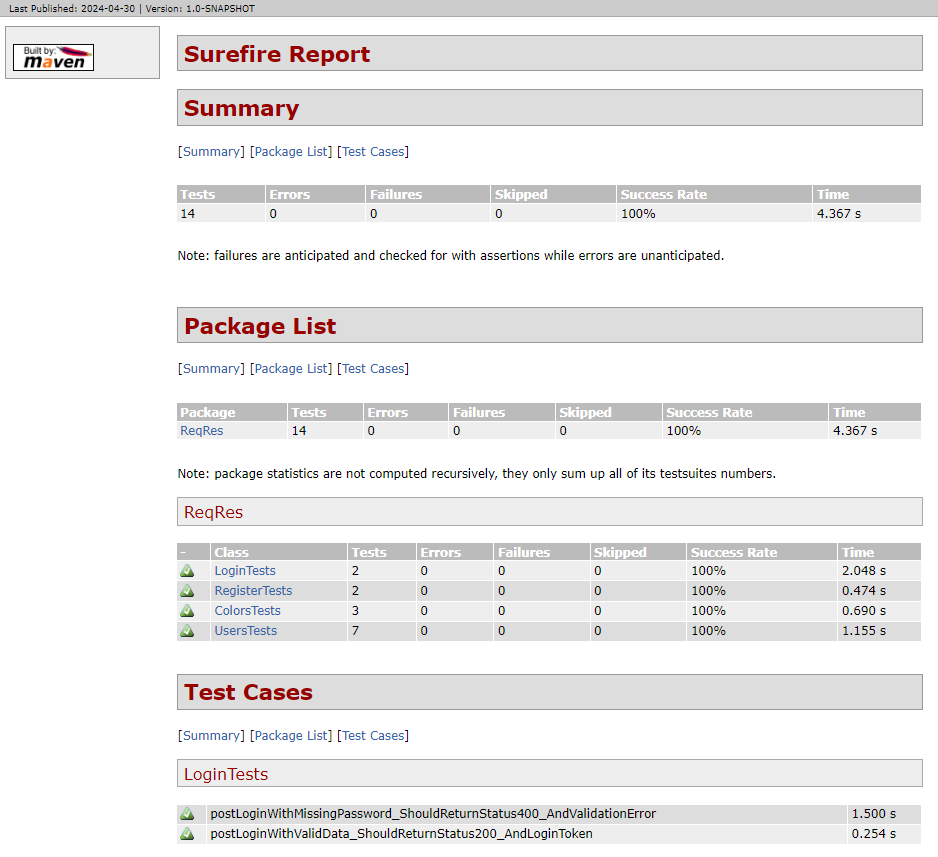
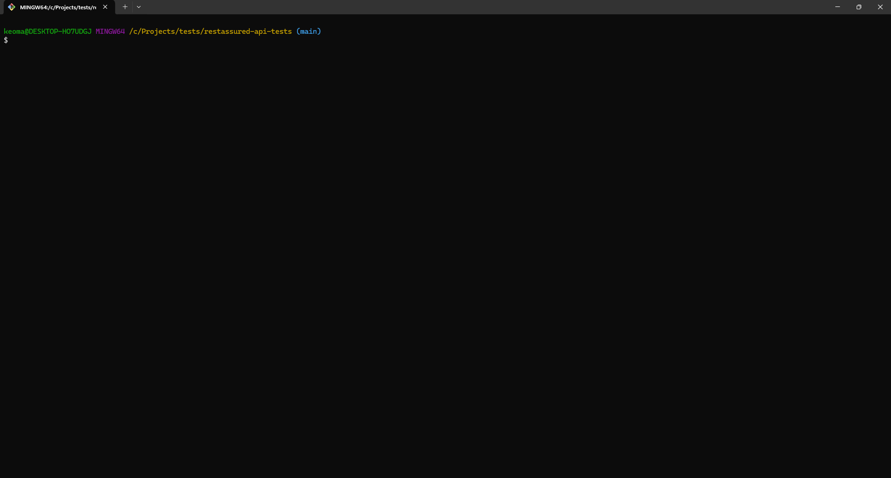

# REST Assured API Tests

A sample API test automation project in [Java](https://www.oracle.com/java/), using [Maven](https://maven.apache.org/), [JUnit 5](https://junit.org/junit5/), [REST Assured](https://rest-assured.io/), and [Jackson](https://github.com/FasterXML/jackson).

## ReqRes

The API chosen for testing was ReqRes. It simulates how a real application behaves, is highly available and accessible from anywhere. For more information, visit their website [here](https://reqres.in/).

## How it works

The project uses Maven for project management, JUnit 5 as the test framework, REST Assured for REST API testing functionality, and Jackson for JSON serialization/deserialization.  
A workflow is set up to install Java, run the tests, and publish the HTML report to GitHub Pages. The report can be viewed [here](https://kafziel4.github.io/restassured-api-tests/).

## How to run it

- Install [Java](https://www.oracle.com/java/technologies/downloads/)
- Install [Maven](https://maven.apache.org/install.html)
- Run the tests and generate the report: `mvn surefire-report:report`

